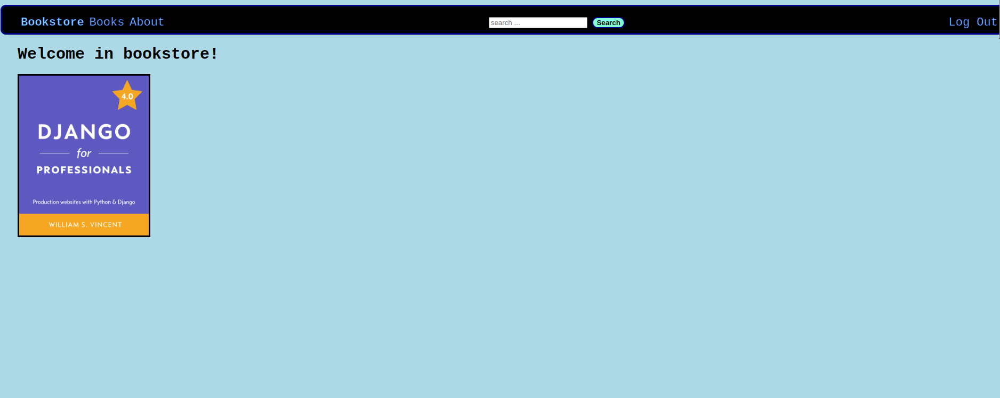

# django-bookstore

## Description
Bookstore app based on the book Django for Professionals by William S. Vincent

- Type: Full-stack web development
- Source: https://www.goodreads.com/book/show/41108453-django-for-beginners
- Date: October/2022
- app is deployed here: https://blooming-everglades-97468.herokuapp.com/

## How to run
Non-dockerized version:
- python -m pip install requirements.txt
- python manage.py runserver
- open the suggested link

Dockerized version:
- docker-compose -up --build
- open the suggested link

## Test user
You can log in with test user:
- name: testuser1
- password: testpass123

## Technologies used:
- Python Django
- Postgres DB
- Docker / docker-compose
- own CSS styling instead of bootstrap

## App screens:
- home page
- 
- book detail page
- 

